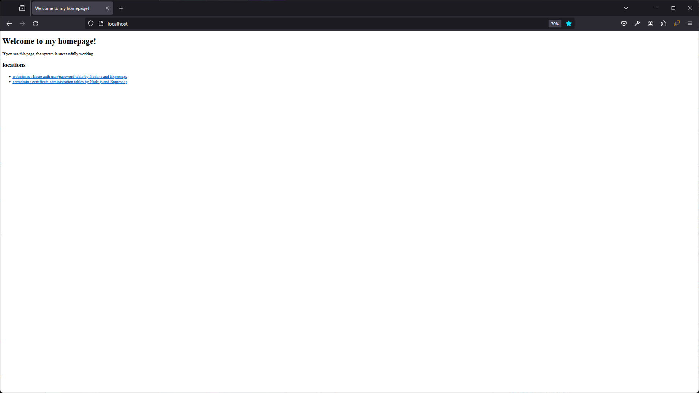
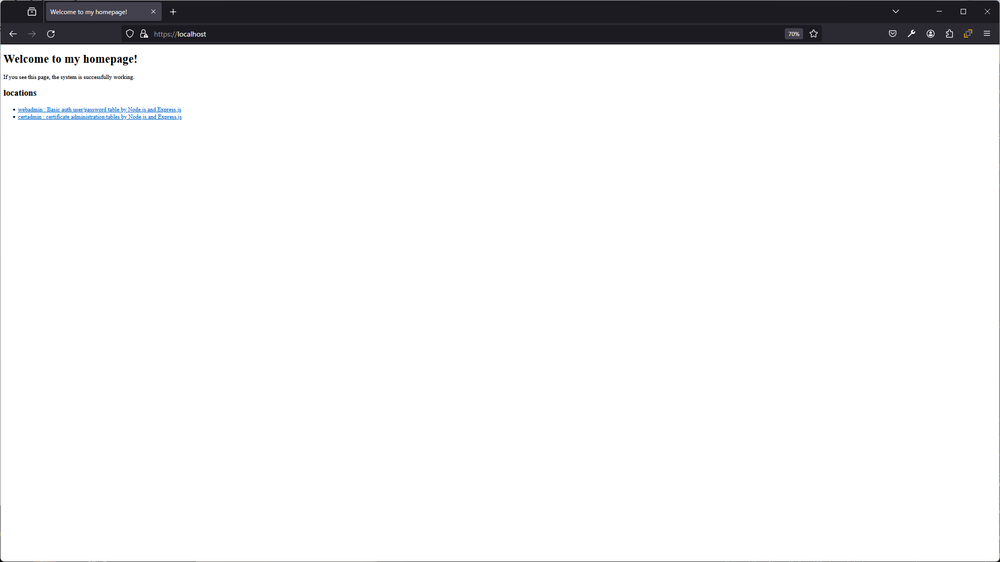

# Basic認証のユーザ・パスワード設定をPosgtreSQLで管理し、nginxで実現するアプリ Nginx コンテナについて

## 目的 Purpose

本コンテナは、[アプリ全体](../README.md) で示した機能のうち、Nginx 機能本体、および、設定機能を提供する。

This app provides a web server with sample setting engine.

## ライセンス License

[アプリ全体](../README.md) を参照。

see [document of this app](../README.md).

このとき、以下のファイルは、未編集の Nginx コンテナより収集した閲覧用サンプルであり、 NGINX および Docker NGINXコンテナのライセンスに従う点に注意する。

These files are under licensed under the 2-clause BSD-like license same as NGINX and Docker NGINX Container License.

* default.conf.org
* index.html.org

## 画面説明 How to use this web browser interface without change (Only in Japanese language.)

* `http://<サーバのIPアドレス>/` にアクセスする。 \
  本アプリ用に差し替えた nginx 標準のデフォルトwebページを表示する。\
  
* リンク先は、各々のコンテナの説明を参照すること。
  * [webadmin](../webadmin/README.md)
  * [certadmin]
* `https://<サーバのIPアドレス>/` でもアクセス可能。 \
  certadmin 機能により設定する証明書（デフォルト状態では`localhost`向け自己署名証明書）により、同じ nginx 標準のデフォルトwebページを表示する。\
  ただし、基本的には信頼できる証明書機関が発行した証明書ではないことから、以下のとおり HTTPS 証明書不正の警告は発生する。\
  \
  

## 機能ごとのファイル構成 Base design of this container (Only in Japanese language.)

* 全体の設定構成
  * Dockerfile
  * sample.conf
* ホーム画面
  * index.html
* BASIC認証のユーザ設定をデータベースから読み取りファイル化する機能
  * docker-entrypoint.d/00_basic_auth_user.sh
  * set_basic_auth_user/index.js
* HTTPS証明書をデータベースから読み取りファイル化する機能
  * docker-entrypoint.d/01_https_cert.sh
  * set_https_cert/index.js

このとき、 sample.conf の編集は他コンテナの設計方針となるため、 [全体の説明](../README.md) を参照すること。
