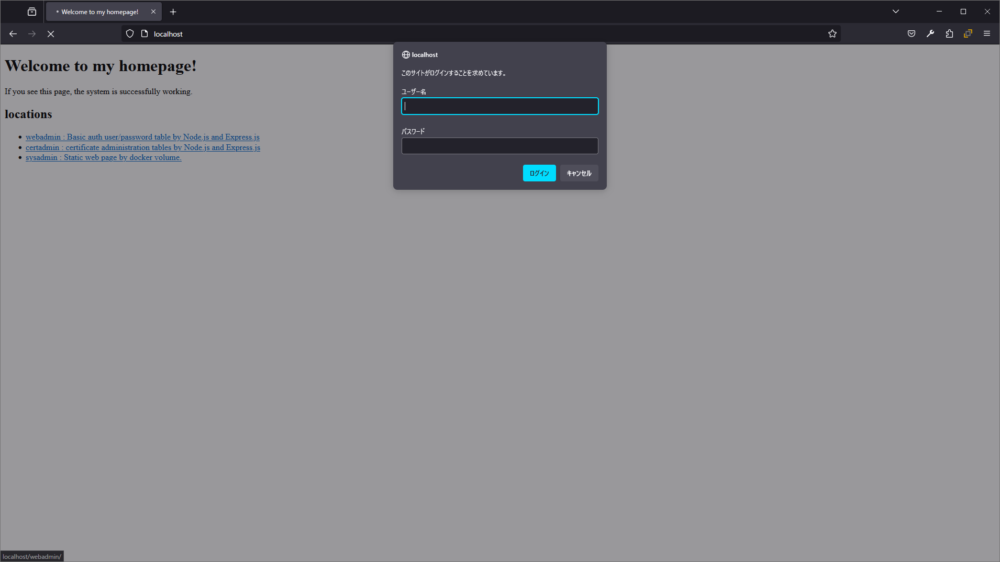
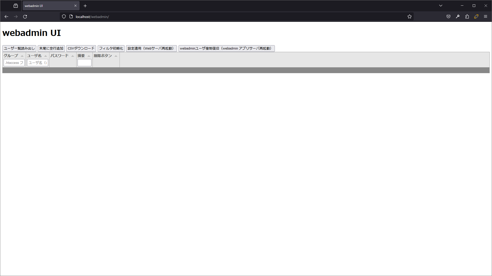
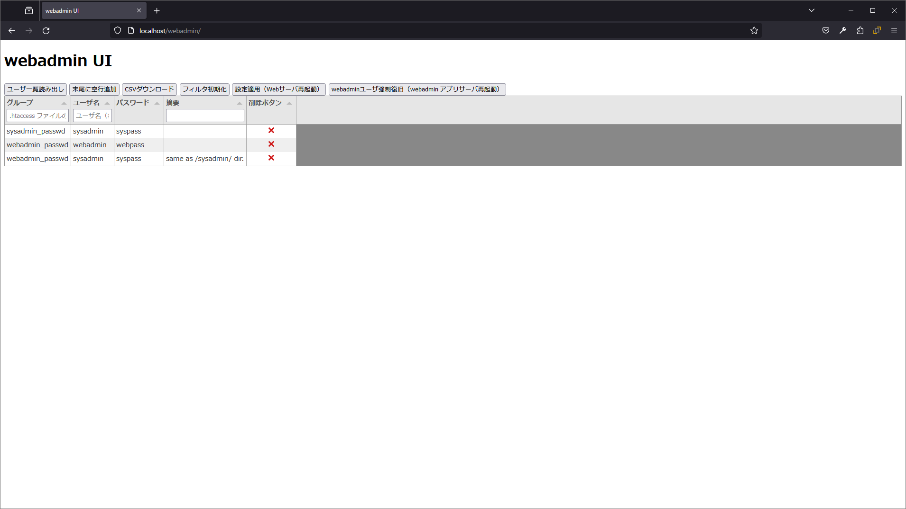

# Basic認証の設定（主にユーザとパスワード）をPosgtreSQLで管理し、nginxで実現するアプリ Webadmin コンテナについて

## 本コンテナの目的 Purpose

本コンテナは、[アプリ全体](../README.md) で示した機能のうち、ユーザ・パスワードを管理するWeb画面およびWebAPIを、サンプル機能として提供する。

This app provides a web browser interface and a web API for managing users and passwords as a sample source code.

## ライセンス License

[アプリ全体](../README.md) を参照。

see [document of this app](../README.md).

## 画面説明 How to use this web browser interface without change (Only in Japanese language.)

* `http://<サーバのIPアドレス>/webadmin/` にアクセスする。\
  BASIC認証によりユーザー名、パスワードを聞かれるので、以下のとおり入力してログインする。\
  ユーザー名： `webadmin`\
  パスワード： `webpass`\
  
* ログインできた直後の画面は以下の通り。 \
  
* ボタン「ユーザ一覧読み出し」で、現在PostgreSQLに入っているデータを表に反映する。\
  
* 以下、適宜操作を行い、グループ・ユーザー名・パスワードをお使いの状態に向けて変更していく。
  * 表の上のボタン操作方法は以下の通り。
    * ユーザ一覧読み出し： データベース上で管理している、正のデータを表に反映する。
    * 末尾に空行追加：表の一番下に、空っぽの行を追加する。データを新規追加するために用いる。
    * CSVダウンロード：現在、表示されているの表をCSVファイルとしてダウンロードする。データ破損時の手動復旧に不可欠であり、適宜実施すること。
    * フィルタ初期化：下記の表のフィルタ文字列を全て削除する。
    * 設定適用（Webサーバ再起動）：Webサーバを再起動し、現在のデータベース上にあるユーザー・パスワード設定をWebサーバに反映する。
    * webadminユーザ強制復旧（webadmin アプリサーバ再起動）：本コンテナを再起動し、現在のデータベースに以下の情報を追記する。 \
      グループ`webadmin_passwd`、ユーザー`webadmin`、パスワード`webpass`\
  * 表の読み方は以下のとおり。
    * グループ：ユーザ名とパスワードを適用するグループ名を指定する。グループ名は nginx コンテナの設定により決定する。詳細は [アプリ全体](../README.md) を参照。
      * サンプルでは `sysadmin_passwd` と `webadmin_passwd` を準備している。
    * ユーザ名：BASIC認証のユーザ名を入力する。複数グループにまたがるユーザは各々設定すること。
    * パスワード：BASIC認証のパスワードを入力する。
    * 摘要：BASIC認証のコメント欄を入力してもよい。
    * 削除ボタン：当該の行のデータを、画面およびデータベースから削除する。
  * 表のデータは編集可能であり、基本的には編集と同時にデータベースに反映される。
    * ただし、グループ名・ユーザ名・パスワードが揃っていない場合はデータベースへの反映は失敗する。これらを揃えるように入力すること。
    * グループ名・ユーザ名の変更操作を行った場合は、変更後のグループ名・ユーザ名を新規追加する。\
      上記の仕様に伴い、変更操作前のグループ名・ユーザ名は画面に残らず、画面とデータベースが不一致となる。\
      変更操作後は上記「ユーザ一覧読み出し」ボタンをクリックして再一致化すること。

## 注意事項 Caution to use

本編集画面をそのまま使うにあたっては、以下の注意事項を念頭に置いて作業すること。

1. 本編集画面は、 nginx コンテナのサーバ設定との一致性を保証しない。 \
   1. 必要なグループは必ず設定すること。
   1. 本機能では、グループ名の誤記を防止できない。
1. 本編集画面では、編集内容がただちにデータベースへ反映されていく。確認画面は存在しない。

## API説明 How to use this web API without change (Only in Japanese language.)

APIの操作自体にBASIC認証が必要となる。実現している機能は [設計資料](./docs/Design.md) を参照。
